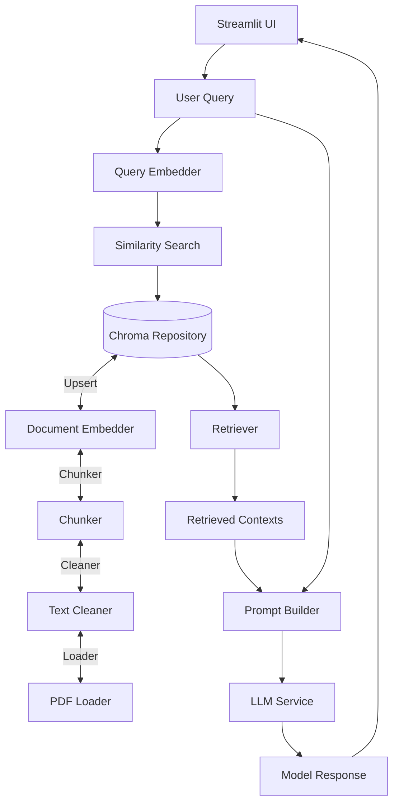

# Academic RAG Assistant (German Academic PDF Assistant)


Retrieval-Augmented Generation (RAG) based academic assistant. It extracts information from German PDF documents, cleans and chunks text, generates embeddings, stores them in a vector database, and answers user questions with reliable, source-grounded responses.

## 🧠 Personal Learning Journey & Motivation

I am a 19-year-old student at **Marmara University**, studying **German Management Information Systems**. Alongside my academic education, I have been independently developing my skills in **artificial intelligence and software engineering**.  

This project represents my first fully independent venture into building an end-to-end RAG/LLM-based system. Developing it was not just a technical exercise—it was an opportunity to explore how to construct AI pipelines that adhere to **industry best practices** in scalability, maintainability, and traceability. 

Throughout the process, I focused on:

- **Strategic pipeline design**: Carefully planning each step from PDF ingestion, text cleaning, and logical chunking, to embedding, hybrid retrieval, and LLM integration.
- **Software engineering principles**: Emphasizing clean architecture, modularity, testing, and configuration management, which are essential for sustainable AI projects.
- **End-to-end understanding**: Experiencing firsthand how every component interacts and how decisions at one stage impact the entire system.
- **Performance & reliability**: Ensuring the assistant provides accurate, source-grounded responses while being efficient and robust.

This project also reinforced an important insight: building AI systems is not solely about producing models or predictions. It requires deliberate engineering, strategic thinking, and adherence to professional standards at every stage. 

I am particularly grateful to the resources provided by **O’Reilly Media** and **Packt Media**, which offered invaluable guidance and knowledge, helping me bridge the gap between theoretical understanding and practical, production-ready implementation.

By undertaking this project, I not only gained technical expertise but also developed a mindset aligned with **real-world AI system development**, preparing me for future challenges in both research and industry contexts.

## 🎯 Why This Project?

- **Fast access to academic knowledge**: Process hundreds of PDF pages in minutes
- **Handle German-specific text issues**: Fix OCR and formatting issues automatically
- **Enhanced and controlled responses**: Answers are enriched using the LLM model’s knowledge parameters in a controlled manner, in addition to source references

## 🚀 Features

- **RAG Pipeline**: PDF → Cleaning → Chunking → Embedding → Chroma (Vector DB) → Hybrid Retrieval → LLM
- **German-focused text cleaning** (OCR errors, ligatures, whitespace normalization, bullet handling, etc.)
- **Persistent vector DB**: Local storage with `Chroma`
- **Hybrid retrieval**: Vector similarity + keyword score
- **LLM integration**: Hugging Face Inference API (Llama 3.1)
- **Streamlit UI**: PDF upload, processing, chat, and context previews
- **Configuration management**: `configs/config.yaml`
- **Docker/Compose support**: Easy setup and run
- **Tests**: Comprehensive unit tests with `pytest`

## 🏗️ Architecture Overview

- **ingestion** → Extract text and structure from PDFs
- **preprocessing** → Clean and logically chunk text
- **embedding** → Document and query embedding services
- **vector_db** → Vector database service (Chroma Repository)
- **rag** → Hybrid search (retriever)
- **services** → RAG pipeline orchestration and LLM services
- **inference** → Streamlit user interface
- **core** → Abstractions/Factories and DB module
- **utils** → Config parser and logger
- **tests** → Pytest unit tests

## 📂 Project Structure

```plaintext
Academic Assistant Project/
├─ configs/
│  └─ config.yaml
├─ data/
│  ├─ embeddings/
│  ├─ processed/
│  └─ raw/
│     └─ sample_document.pdf (used for the purposes of project development and testing, and was later removed.)
├─ src/
│  ├─ core/
│  │  ├─ abstractions/
│  │  ├─ factories/
│  │  └─ vector_database_module.py
│  ├─ implementations/
│  │  ├─ chunking/
│  │  ├─ embedding/
│  │  ├─ preprocessing/
│  │  └─ vector_db/
│  ├─ inference/
│  ├─ ingestion/
│  ├─ preprocessing/
│  ├─ rag/
│  ├─ services/
│  └─ utils/
├─ tests/
│  ├─ test_chunker.py
│  ├─ test_embedder.py
│  ├─ test_llm_service.py
│  ├─ test_pdf_loader.py
│  ├─ test_rag_pipeline.py
│  ├─ test_retriever.py
│  ├─ test_text_cleaner.py
│  └─ test_vectordb.py
├─ docker-compose.yml
├─ Dockerfile
├─ docker-entrypoint.sh
├─ nginx.conf
├─ env.example
├─ .dockerignore
├─ pyproject.toml
├─ poetry.lock
├─ README.md
└─ LICENSE
```

## 📂 Workflow



## ⚙️ Setup

### System Requirements (Recommended)

- Python 3.8+
- RAM: Minimum 4 GB
- Disk: 2 GB free space

### 1) With Poetry (Recommended)

```bash
# Clone the repository
git clone <repo-url>
cd Academic-Rag-Assistant

# Install dependencies (Poetry will create a virtual environment automatically)
poetry lock
poetry install
```

# Running the Streamlit App
```bash
# Make sure Python can find the `src` folder before running the app

# Git Bash / Linux / macOS
export PYTHONPATH=$(pwd)
poetry run streamlit run src/inference/streamlit_ui.py

# PowerShell (Windows)
$env:PYTHONPATH=(Get-Location)
poetry run streamlit run src/inference/streamlit_ui.py

# CMD (Windows)
set PYTHONPATH=%cd%
poetry run streamlit run src/inference/streamlit_ui.py

# The app will be available at: http://localhost:8501
```

### 2) With Docker

#### Quick Start
```bash
# Clone and start the application
git clone <repo-url>
cd Academic-Assistant-Project
docker-compose up --build

# Access the application at http://localhost:8501
```

#### Production Mode (with Nginx)
```bash
# Start with reverse proxy for production
docker-compose --profile production up -d --build

# Access via Nginx at http://localhost:80
```

#### Docker Features
- **Multi-stage build** for optimized image size
- **Non-root user** for security
- **Health checks** and graceful shutdown
- **Persistent volumes** for data, logs, and cache
- **Resource limits** and security hardening
- **Nginx reverse proxy** with SSL support (production mode)

#### Environment Configuration
```bash
# Optional: Copy and customize environment settings
cp env.example .env
# Edit .env if you need custom configurations
```

**Note**: Hugging Face API token is entered directly in the Streamlit UI - no environment setup required!

## ▶️ Usage

1) Get a Hugging Face API Token (see Hugging Face Tokens)
2) Enter the token in the Streamlit UI
3) Upload a PDF (≤ 10 MB, German text-based PDF)
4) Process PDF → cleaning, embeddings, save to Chroma
5) Ask questions from the “Chat” tab

### Hint

Try to ask questions using the concepts mentioned in the sources you have uploaded.

## 🧪 Tests

```bash
pytest tests/
```

Test Coverage:

- PDF extraction
- Text cleaning
- Embedding services
- Retriever (hybrid search)
- RAG pipeline
- LLM service contracts
- Vector DB integration

Extended coverage:

```bash
pytest --cov=src tests/
```

## 🔍 Technical Details

### Hybrid Retrieval

```python
hybrid_score = vector_weight * vector_score + keyword_weight * keyword_score
```

- German stopword filtering + TF‑IDF-like normalization

### Embedding

- Queries → SentenceTransformers (query embeddings)
- Documents → Transformer-based embedder (E5)

### LLM Service

- Hugging Face Inference API (Llama 3.1)
- `generate_response()` for testing and `stream_response()` for UI
- Prompt templates support German

### PDF Loader

- Powered by `pdfplumber` with line, table, and header extraction

## 🔧 Troubleshooting

### Common Issues

**PDF does not upload**
- Ensure file size ≤ 10 MB
- Use text-based PDFs (not scanned images)

**Embedding error**
- Verify your Hugging Face token is valid
- Check your internet connection

**Chroma DB error**
```bash
# Local development
rm -rf chroma_db/
# Restart the application

# Docker
docker-compose down -v
docker-compose up --build
```

**Docker Issues**
```bash
# Check container status
docker-compose ps

# View logs
docker-compose logs -f academic-rag-assistant

# Health check
curl http://localhost:8501/_stcore/health

# Port conflict (change port in .env)
STREAMLIT_SERVER_PORT=8502
```

**Memory Issues**
- Ensure Docker has at least 4GB RAM allocated
- For large PDFs, increase Docker memory limits

## 🛠️ Optional Roadmap

- Advanced PDF chunking (headings, figures, equations, tables semantics)
- UI source attributions with page/location highlighting
- Multi-language support
- Generating tests based on the uploaded PDF content

## 🤝 Contributing

1. Fork the repository
2. Create a feature branch (`git checkout -b feature/amazing-feature`)
3. Add tests
4. Commit (`git commit -m 'feat: add amazing feature'`)
5. Push (`git push origin feature/amazing-feature`)
6. Open a Pull Request

### Code Standards

```bash
# Linting
black src/ tests/
flake8 src/ tests/

# Tests
pytest --cov=src tests/
```

## 📜 License

This project is licensed under the MIT License. See the `LICENSE` file for details.

## ⭐ Star This Repo

If you find this project useful, please consider giving it a ⭐!

---
